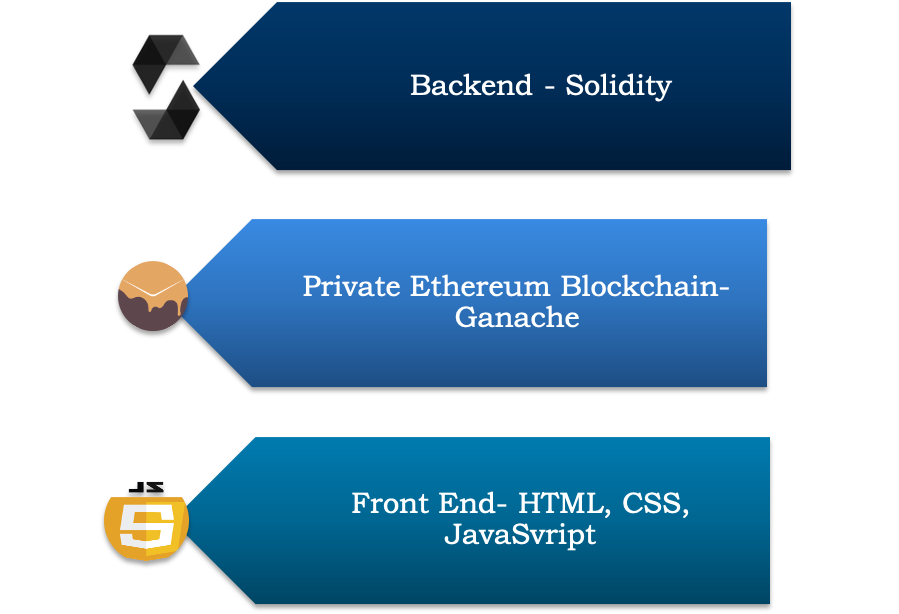

   <h2>
      Supply Chain Using Ethereum Blockchain
   </h2>

<h4>
   Table of Contents:
</h4>
<ul>
   <li> <a href="#intro">Introduction </a></li>
   <li> <a href="#tools">Tools Used </a></li>
   <li> <a href="#run">How to Run</a></li>
   <!--<li> <a href="#demo">Demo Video </a></li>-->
</ul>
<h3 id = "intro">
   Introduction:
</h3>

   <!--This is a course project made as a part of EECE 571G [ Software Engineering in Blockchain ] course at UBC. We plan to implement a supply chain system using blockchain as backend and reactjs for component based ui system. The system would be open for the Distributer, Retailer, Producer to see the information of any product that the relevant party might have dealt with. For a Vendor making products , For Example a Mobile maker, they can track the components , their price , their inventory, and who made the component of the product if they chose to offload it.-->
   This is a course project made as a part of EECE 571G [ Software Engineering in Blockchain ] course at UBC.<!-- We have implemented a blockchain solution to create a decentralized market place. We have used Solidity programming language at the backend. The front end has been created using HTML, CSS and JavaScript. We are using the blockchain through Ganache. -->

   The main stakeholders in the project are:
<!--<ul>
   <li>Manufacturing Company </li>
   <li>Admin Company</li>
   <li>Distributor</li>
   <li>Retailer</li>
   <li>Customer</li>
</ul>-->
    
   
   Manufacturing Company 
   Admin Company           
   Distributor  
   Retailer  
   Customer  

   The main pain point under consideration is that the customer can see the components and their manufacturer in order to circumvent fraud. Our project also tackles the problem of non-payment or ill timed payments to seller through our smart contracts. <!--	Similarly, for distributers and retailers, they can directly see the parties involved in supply chain. -->. The project will also focus on ownership transfer and profit distribution among the vendor , retailer and distributer.

<h3 id = "tools">
   Tools used: 
   
</h3>

<h3 id = "run">How to run</h3>
<ol>
   <li>Download the files in the folder called Final</li>
   <li>Open the folder in Vs code</li>
   <li>Open the .sol file</li>
   <li>Run Ganache and choose quickstart</li>
   <li>Back in VScode open terminal,check the node version using node -v</li>
   <li>Run the following commands</li>
   <ol>
      <li>npm install</li>
      <li>truffle compile</li>
      <li>truffle migrate</li>
   </ol>
   
   <li>In the browser, open index.html. Different portals can be accessed from index.html </li>
</ol>
<h4> Notes</h4>
<ol>
   <li>We plan to integrate login mechanism in the project so that only the respective stakeholder can access their portals</li>
   <li> The browser settings need to be changed as follws in order to access the files, since we are using Web3</li>
   <ul>
      <h4><li> Firefox </li></h4>
      	For Firefox:
   If you run in Firefox, it is easy for you to finish the configuration. 
   1.	Open you Firefox. 
   2.	In your address bar, go to about:config  
   3.	Accept the Risk and Continue 
   4.	You will see a search bar, search the keyword Origin 
   5.	Look for security.fileuri.strict_origin_policy 
   6.	It default value is true, we need to change it to false. Double clicking that entry should work for our purpose. 
   7.	Close and relaunch your Firefox. 
   8.	Done. 
      <h4><li> Chrome </li></h4> 
      <h4>	MacOS</h4>
Run your Google Chrome with the following Command  
[Refer mine for an example]: 

/Applications/Google\ Chrome.app/Contents/MacOS/Google\ Chrome --user-data-dir="~/chrome" --disable-web-security

Usually, Google Chrome is found in /Applications folder. Even though it is named as “Google Chrome.app”, but it is a directory (i.e., folder). The executable file is in 
/Applications/Google\ Chrome.app/Contents/MacOS  

The backslash is escaping that space. You need to keep the same options 
--user-data-dir="~/chrome" --disable-web-security  

<h4>	Linux  </h4>
google-chrome --user-data-dir="~/chrome" --disable-web-security  

Usually, google-chrome is a resolvable command in your Ubuntu.  

If not, you need to find where is your google-chrome runnable file. From command line, go to the folder where google-chrome locates and run this command instead:
./google-chrome --user-data-dir="~/chrome" --disable-web-security
  
<h4>Windows</h4>
First, you need to know where is your Google Chrome executable file (i.e., chrome.exe). From your task bar, type Google Chrome and expand the preview options shown on the right-hand-side. 
Then, select the Open File Location. It usually locates the shortcut of your Google Chrome runnable file. Right click the shortcut file and show its property will reveal where is your Google Chrome executable file (i.e., chrome.exe) location. From window DoS command line, go to the folder where Google Chrome executable file locates, then run
Chrome.exe --user-data-dir="C:\chrome" --disable-web-security

   </ul>
</ol>

<h3>Team Members</h3>
<ul>
   <li>Kritika Arora</li>
   <li>Rishab Madaan</li>
   <li>Garima Aggarwal</li>
   <li>Dinesh Pabbi</li>
   <li>Kunal Verma</li>
</ul>
